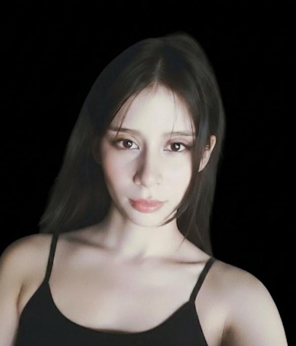

# Programacion.videojuegos
Etapa 1 - Reconocimiento del entorno y armado de equipos con SCV.

# Integrantes del Proyecto

## Jasmaye
* **Rol en la industria:** Programadora / Diseñadora
* **Ubicación:** Colombia
* **Perfil:** Estudiante de Ingeniería Multimedia interesada en el desarrollo de videojuegos y diseño digital.

 
## Angela Becerra
* **Rol:** UX/UI Designer
* **Ubicación:** Cúcuta, Colombia
* **Perfil:** Estudiante enfocada en el diseño de interfaz y experiencia de usuario para videojuegos, interesada en mecánicas, accesibilidad e impacto visual.

