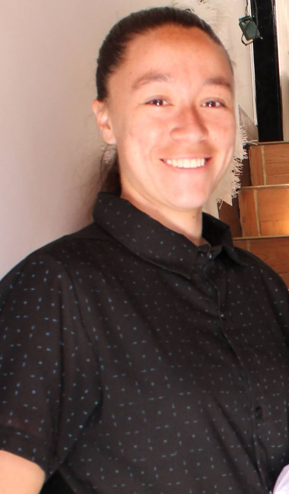

# Programacion.videojuegos
Etapa 1 - Reconocimiento del entorno y armado de equipos con SCV.
---
# Integrantes del Proyecto
---
## Jasmaye
* **Rol en la industria:** Programadora / Diseñadora
* **Ubicación:** Colombia
* **Perfil:** Estudiante de Ingeniería Multimedia interesada en el desarrollo de videojuegos y diseño digital.

## Angela Becerra
* **Rol:** UX/UI Designer
* **Ubicación:** Cúcuta, Colombia
* **Perfil:** Estudiante enfocada en el diseño de interfaz y experiencia de usuario para videojuegos, interesada en mecánicas, accesibilidad e impacto visual.

---
## Maria Fernanda
* **Rol:** Programadora/Artista
* **Ubicación:** Arauca, Colombia
* **Perfil:** Soy estudiante de Ingeniería Multimedia y me apasiona el dibujo, los colores y la creatividad. Me gusta la idea de crear cosas que puedan entretener, divertir y generar experiencias positivas en otras personas. Me interesa especialmente combinar el arte y la tecnología para desarrollar proyectos creativos. 

